# Comprendre la Transformation de Fourier Discrète (TFD)

Si vous êtes ici, c’est que comme moi vous vous êtes retrouvé devant les termes : analyse fréquentielle, Fourier, TFD ou FFT. Et que cette rencontre vous a laissé avec plus de doutes que de réponses. Dans mon cas, je sais que j’avais étudié la transformé de Fourier il y a quelques temps de cela à l’école. Cependant c’était resté assez théorique et des années plus tard il m’a fallu ramer un moment sur Internet pour retisser la notion dans mon esprit. Cet article est un rapide tour d’horizon du sujet pour bien comprendre à quoi sert la transformé de Fourier.

## Créer et étudier un signal simple

Avant de se lancer dans l’analyse d’un signal, il est intéressant d’apprendre comment en créer un. Nous allons donc voir comment créer notre propre signal **signal(t)** en fonction du temps t.

Le plus simple est de créer un signal périodique avec la fonction sinus.

Étudier ce signal en fréquence revient tout simplement à calculer la fréquence de la fonction sinus

On sait que la période T de sinus est:

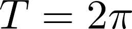

La période d’une fonction étant la plus petite valeur T telle que la fonction se répète. C’est à dire que:

A partir de la période on peut calculer la fréquence avec la formule suivante:

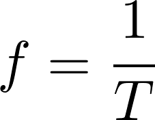

Donc notre signal basé sur sinus a une fréquence de:

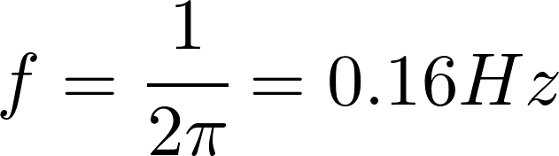

## Modifier la fréquence du signal sinus

Maintenant on peut se demander comment créer un signal avec une fréquence donnée, par exemple 50Hz.

Pour cela on va ajouter 2 paramètres à notre sinus a et b tel que:

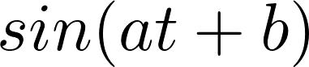

A partir de cela, on peut démontrer comment définir les paramètres de notre sinus en fonction de la période

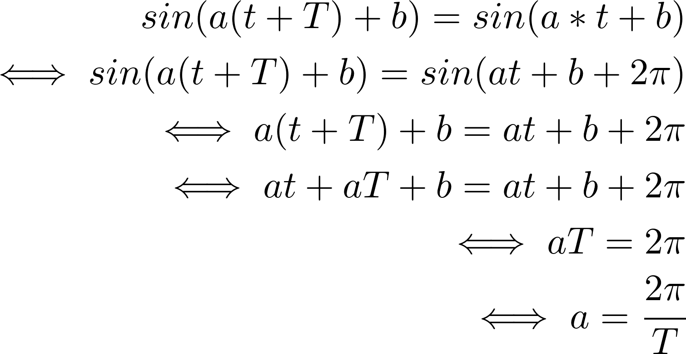

On peut remarquer que seul le coefficient a a une influence sur la fréquence.Donc si on veut un signal périodique à 50Hz. On peut maintenant calculer la période et le coefficient a

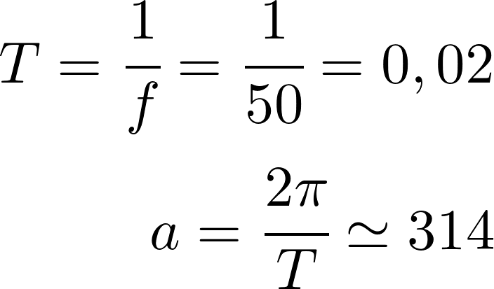

Et enfin on a notre signal à 50Hz

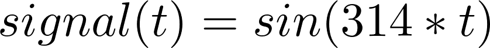

## Créer un signal multifréquences

Passons encore une étape.
Qu’est ce qui se passerait si on prenez un signal à 1Hz et un signal à 50Hz et qu’on les combiner?
Signal 1Hz

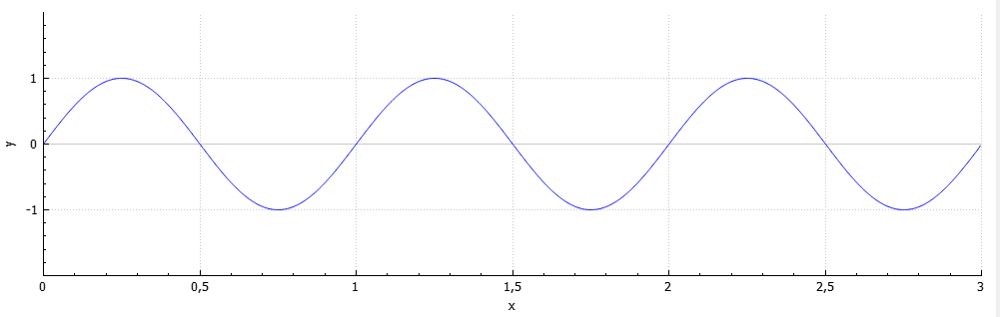

Signal 50Hz

Combinaison des 2 signaux

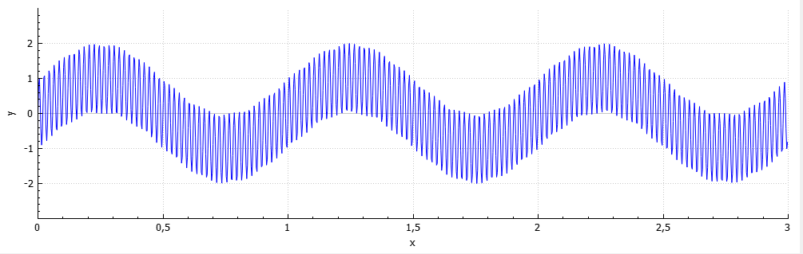

Pour cette dernière étape un petite explication s’impose. Rien de bien compliquer pour combiner 2 signaux basés sur des sinus il suffit de les additionner.

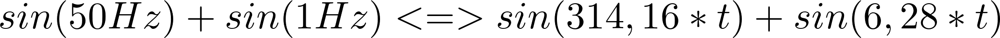

(Retenez bien ce signal il va nous servir pour notre exemple fil rouge.)

Et si vous voulez plus de fréquences dans votre signal ajouter autant de sinus en plus dans l’équation que de fréquences désirées.Cependant vous voyez bien
qu’avec 2 fréquences dans notre signal, le visuel commence à devenir un peu illisible. Je vous laisse donc imaginer la tête horrible que doit avoir un signal réel avec
des centaines de fréquences et bruit dans tous les sens.

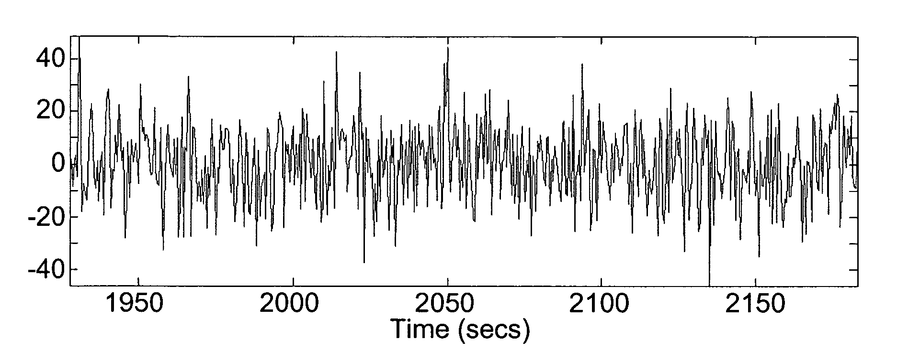

Cependant il y a des gens qui se sont posés la question suivante : Est-ce qu’il serait possible de retrouver toutes les fréquences d’un signal quelconque et de
reconstruire son équation ?

Attention gros spoil : c’est M. Fourier qui a trouvé la réponse :-)

Cependant avant de pouvoir utiliser sa transformation magique il va nous falloir régler un problème bien embêtant : dans ce monde réel haut en couleur tout est analogique alors que sur nos sombres machines tout est numérique. Pour régler ce problème, la solution c’est l’échantillonnage.

## L’échantillonnage

L’échantillonnage c’est simple, vu que l’on ne peut pas stocker le signal analogiquement, c’est-à-dire avec un temps continue, on va ne prendre que quelques valeurs de ce signal dans le temps et supposer qu’entre ces relevés il n’y a eu qu’une « ligne droite ». Cependant si les paramètres de l’échantillonnage sont mal choisis, on risque entre 2 relevés de louper de l’information importante.

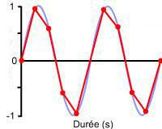

Heureusement pour nous il y a quelques règles simples pour ne pas se planter.

1. Il faut se demander quelle est la fréquence la plus haute que l’on veut identifier. Nous l’appellerons Fm comme fréquence à mesurer.

=> Si on prend l’exemple de notre signal 2 fréquences la fréquence la plus haute c’est 50Hz donc Fm=50Hz.

2. Ensuite nous pouvons choisir la fréquence d’échantillonnage Fe (la vitesse de récupération des points). Fe doit être supérieur à au moins 2 fois Fm (voir
Théorème de Shannon). Du coup moi je prend généralement2,5 fois comme ça je suis bon.

=> Pour l’exemple ça donne Fe=2,5×50=125Hz.

3. Enfin, après avoir trouvé à quelle vitesse il nous fallait récupérer les valeurs du signal, il nous faut choisir N le nombre de points nous allons relever.

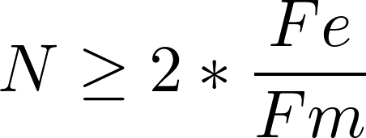

=> Pour l’exemple, on va prendre très large et on va sélectionner 512 points

Très bien, avec tous ces paramètres nous avons réalisé notre échantillon de signal. Nous avons dans un buffer « signal » nos 512 valeurs récupérés à une fréquence de 125Hz. Il est donc arrivé le temps de la Transformé de Fourier… Discrète

## La Transformation de Fourier Discrète

Pour commencer, je vais rappeler la formule :

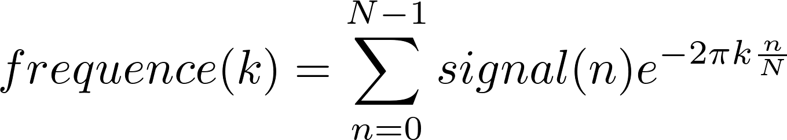

Décortiquons cette formule et commençons par les éléments que l’on connait:

- N: le nombre de valeurs dans notre échantillon
- signal: Le buffer contenant les N valeurs de notre échantillon
- Enfin toute cette formule produit un tableau nommé: frequence. C’est un buffer de taille N dans lequel chaque indice va stocker une valeur complexe contenant la “valeur” de la fréquence associée à l’indice k.

Comment ça la fréquence associée à l’indice k?

Chaque indice k du tableau frequence représente une fréquence. Pour connaitre cette fréquence il faut que l’on calcule la précision spectrale.

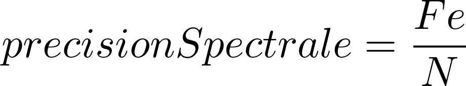

Dans notre exemple fil rouge, Fe=125 et N=512 donc la précision spectrale est de 0,24Hz. Ensuite pour calculer la fréquence associée à l’indice k on utilise la simple formule:

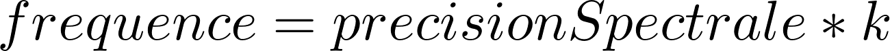

Ce qui veut aussi dire que si vous voulez la “valeur” de la fréquence 50Hz, il vous faut aller voir du coté de l’indice k=208, car 208*0,24 est environ égale à 50Hz.

Et maintenant, comment ça se calcul l’exponentiel avec un nombre imaginaire?

Pour répondre à cette question, je vais vous fournir une légère transformation de la formule de la TFD.

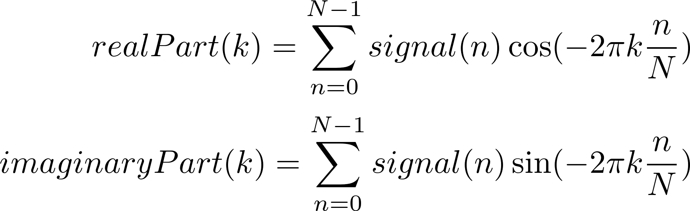

Maintenant, je pense que l’on a fait le tour des questions sur cette formule. On va pouvoir passer à un peu de code.

## Le petit code :-)

Pour m’entrainer et rendre ça un peu plus concret, j’ai fait un petit programme sous Qt. Vous pouvez le télécharger ici:

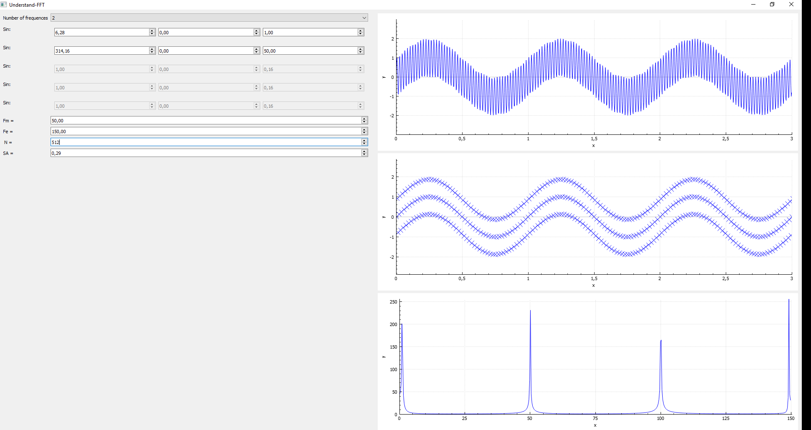
